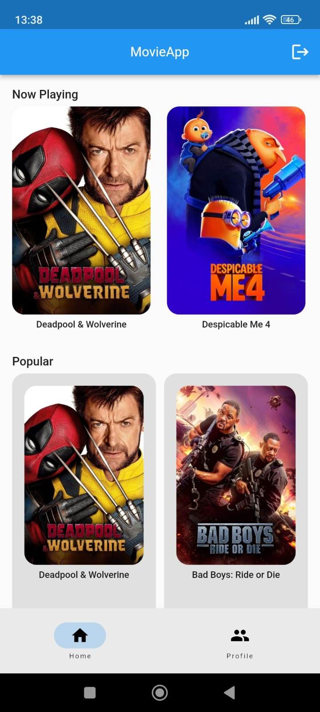
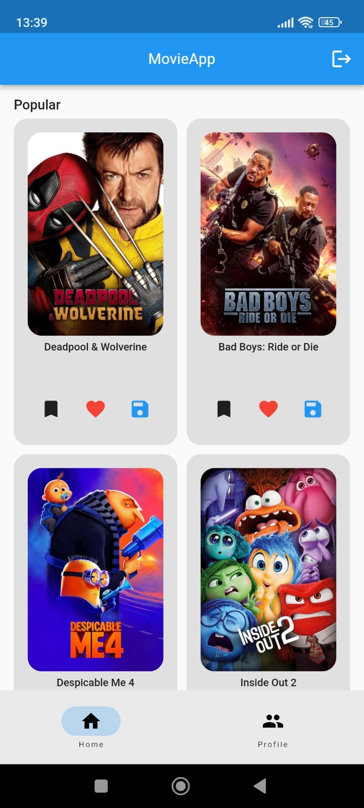
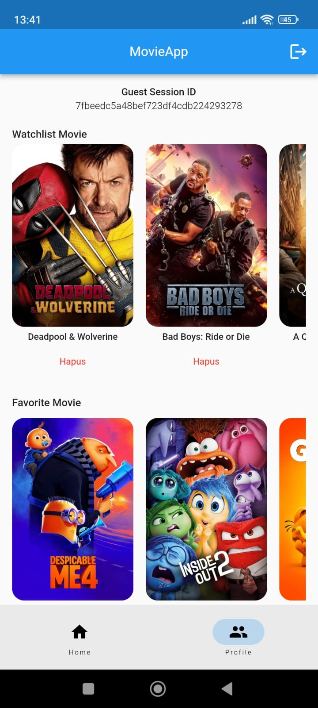

# MovieApp

MovieApp adalah aplikasi untuk melihat informasi film yang sedang tayang, film populer, menambahkan film ke watchlist atau daftar favorit dan menyimpan gambar film ke penyimpanan lokal. Aplikasi ini memungkinkan pengguna untuk masuk sebagai Guest dengan akses ke berbagai fitur yang tersedia dalam aplikasi.

## Fitur Utama

1. Profile

    Menu Profile digunakan untuk melihat dan mengelola daftar film yang telah Anda tambahkan ke watchlist atau daftar favorit.

    - Watchlist Movie: Daftar film yang ingin Anda tonton nanti.
    - Favorite Movie: Daftar film favorit Anda.

2. Home

    Menu Home menampilkan informasi terkini mengenai film yang sedang tayang dan film populer. Pengguna dapat menambah film ke watchlist atau daftar favorit langsung dari menu ini, dan menyimpan gambar film ke penyimpanan lokal.

    - Now Playing: Menampilkan hingga 6 film yang sedang tayang.
    - Popular: Menampilkan hingga 20 film populer.
    - Add to Watchlist: Tombol untuk menambahkan film ke watchlist.
    - Add to Favorite: Tombol untuk menambahkan film ke daftar favorit.
    - Image Save to Local Storage: Fitur untuk menyimpan gambar poster film ke penyimpanan lokal perangkat.

3. Detail Movie

    Menu detail film memberikan informasi lengkap mengenai sebuah film, serta menampilkan rekomendasi film serupa berdasarkan genre.
    - Movie Detail: Menampilkan informasi detail tentang film yang dipilih, yang diakses melalui layar beranda.
    - Similar Movie: Menampilkan daftar film serupa yang diambil berdasarkan genre yang sama.

## Screenshots

    

## Authors

- [@pahlewiakbar](https://github.com/pahlewiakbar)

